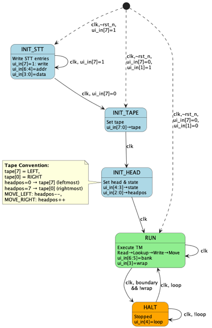

<!---

This file is used to generate your project datasheet. Please fill in the information below and delete any unused
sections.

You can also include images in this folder and reference them in the markdown. Each image must be less than
512 kb in size, and the combined size of all images must be less than 1 MB.
-->

## How it works

This project implements a **Turing Machine** on an ASIC with the following features:

### Core Components
- **8-bit tape** with configurable wrap-around mode
- **4 states** (S0-S3) with **unary alphabet** ( Blank/0 and 1)
- **State Transition Table (STT)** with 4 banks:
  - Bank 0: **Unary Incrementer** - Adds one "1" to a string of ones
  - Bank 1: **Bit Flipper** - Inverts all bits from left to right
  - Bank 2: **Wall-E** - Carries Bits from right side to left bound
  - Bank 3: **Custom** - User-configurable STT

### Operating Modes

The machine operates in 5 distinct modes:
- **INIT**: Initial state after reset, loading configuration
- **WRITE_TAPE**: Writing initial tape values
- **WRITE_HEAD**: Setting head position and initial state
- **RUN**: Executing the Turing Machine program
- **HALT**: Machine stopped at boundary (unless wrap mode enabled)

### Output Routing

Two 8-bit outputs are available:

- **uo_out**: Normally shows tape, or status when swapped
- **uio_out**: Normally shows status, or tape when swapped

Status format (8 bits):
- `[7:5]`: Mode (0-4)
- `[4:3]`: Current state (0-3)
- `[2:0]`: Head position (0-7)

Head position: The status output can be switched to a (one hot) decoded head position output by setting `ui_in[0]=1`.

Swap control: `ui_in[2]=1` swaps the outputs.

## How to test

### Quick Test (Preset 0: Unary Incrementer)

1. **Reset with all inputs low**: `ui_in = 00000000`
   - Loads Bank 0 (Unary Incrementer) preset
   - Initial tape: `11100000` (three 1s on left)
   - Head at position 0 (leftmost)
   - State 0

2. **Clock slowly** (manual or low frequency)
   - Observe `uo_out` (tape) changing
   - Expected behavior:
     - Head moves right through the 1s
     - Finds first 0, writes 1
     - Result: `11110000` (four 1s)
     - Machine halts at right boundary

3. **Observe outputs**:
   - `uo_out`: Shows tape pattern (LEDs on bits 7-4)
   - `uio_out[7:5]`: Mode (should be 3=RUN, then 4=HALT)
   - `uio_out[2:0]`: Head position (counts 0→7)

### Advanced Tests

**Test Loop Mode** (Auto-restart):
1. Reset: `ui_in = 00010000` (loop enabled, bit 4=1)
2. Clock continuously
3. Machine will halt, then automatically restart with initial tape
4. Observe repeating pattern

**Test Wrap Mode** (Endless tape):
1. Reset: `ui_in = 00001000` (wrap enabled, bit 3=1)
2. Clock continuously
3. Head wraps around at boundaries, never halts
4. Useful for Bank 1 (Bit Flipper) to see full tape processed

**Test Custom STT**:
1. Reset: `ui_in = 10000000` (manual mode, bit 7=1)
2. Write 8 STT entries:
   - Example: `ui_in = 10000011` writes `0011` (S0,1,R) to address 0
   - Increment address bits [6:4] for each entry
3. Exit config: `ui_in = 00000000`
4. Set tape: `ui_in = 10101010`
5. Next clock: Set head/state: `ui_in = 00000011` (state 0, position 3)
6. Run: `ui_in = 01100000` (Bank 3, no wrap/loop)

**Test Output Swap**:
1. Start any preset
2. Toggle `ui_in[2]` between 0 and 1
3. Observe tape ↔ status swapping between `uo_out` and `uio_out`

## External hardware

**For Tape Visualization:**
- **LED PMOD** with 8 LEDs in a row
- **7-Segement-Display:** might also be useful but not as intuitive

**For Status Display:**
  - **LED PMOD** with 8 LEDs in a row
  - Display mode(0-4), head position (0-7) and current state (0-3)
  - With switch `ui_in[0]=1` the one-hot decoded head position is shown

**For Manual Control:**
- **DIP Switch**
  - Connect to `ui_in`
  - Allows manual control of all settings:
    - Switch 7: Config/Auto mode
    - Switches 6-5: Bank selection
    - Switch 4: Loop enable
    - Switch 3: Wrap enable
    - Switch 2: Output swap
    - Switch 1: Manual tape init
    - Switch 0: Head position decode
  - Depending on mode allows also STT, Tape, Head and State configuration 
- Clock button (for configuration and manual mode/state transistion)
- Reset button

